# 设计文档

## 概述

本设计文档描述了为 `network-debugger` 包引入 Vitest 测试框架的技术方案。该方案将配置一个完整的单元测试环境，支持无需浏览器运行测试，并通过 Mock 系统模拟外部依赖，最终实现主线程和子线程代码 100% 的测试覆盖率。

## 架构

### 整体架构

```mermaid
graph TB
    subgraph "测试框架层"
        VT[Vitest Test Runner]
        VC[Vitest Coverage]
    end

    subgraph "Mock 层"
        MW[Mock WebSocket]
        MH[Mock HTTP/HTTPS]
        MF[Mock File System]
        MC[Mock Child Process]
        MO[Mock Open Package]
    end

    subgraph "测试目标"
        subgraph "主线程代码 src/core/"
            CI[index.ts]
            CF[fetch.ts]
            CR[request.ts]
            CFK[fork.ts]
            CU[undici.ts]
            CH[hooks/]
            CW[ws/]
        end

        subgraph "子线程代码 src/fork/"
            FRC[request-center.ts]
            FRS[resource-service.ts]
            FD[devtool/]
            FM[module/]
            FP[pipe/]
        end

        subgraph "工具函数 src/utils/"
            UC[call-site.ts]
            US[stack.ts]
            UH[header.ts]
            UJ[json.ts]
            UM[map.ts]
            UG[generate.ts]
            UF[file.ts]
            UP[process.ts]
        end

        COM[common.ts]
    end

    VT --> MW
    VT --> MH
    VT --> MF
    VT --> MC
    VT --> MO

    MW --> CI
    MW --> CFK
    MW --> FRC
    MW --> FD

    MH --> CF
    MH --> CR
    MH --> CU

    MF --> FRS
    MF --> UF

    MC --> CFK

    MO --> FD

    VC --> CI
    VC --> CF
    VC --> CR
    VC --> CFK
    VC --> CU
    VC --> CH
    VC --> CW
    VC --> FRC
    VC --> FRS
    VC --> FD
    VC --> FM
    VC --> FP
    VC --> UC
    VC --> US
    VC --> UH
    VC --> UJ
    VC --> UM
    VC --> UG
    VC --> UF
    VC --> UP
    VC --> COM
```



### 测试文件组织结构

```
packages/network-debugger/
├── src/
│   ├── core/
│   │   ├── __tests__/
│   │   │   ├── index.test.ts
│   │   │   ├── fetch.test.ts
│   │   │   ├── request.test.ts
│   │   │   ├── fork.test.ts
│   │   │   └── undici.test.ts
│   │   ├── hooks/
│   │   │   └── __tests__/
│   │   │       ├── cell.test.ts
│   │   │       ├── useAbortRequest.test.ts
│   │   │       ├── useRegisterRequest.test.ts
│   │   │       └── useRequestPipe.test.ts
│   │   └── ws/
│   │       └── __tests__/
│   │           ├── buffer-util.test.ts
│   │           ├── constants.test.ts
│   │           ├── limiter.test.ts
│   │           ├── permessage-deflate.test.ts
│   │           ├── receiver.test.ts
│   │           └── validation.test.ts
│   ├── fork/
│   │   ├── __tests__/
│   │   │   ├── request-center.test.ts
│   │   │   ├── resource-service.test.ts
│   │   │   └── fork.test.ts
│   │   ├── devtool/
│   │   │   └── __tests__/
│   │   │       ├── index.test.ts
│   │   │       └── type.test.ts
│   │   ├── module/
│   │   │   └── __tests__/
│   │   │       ├── common.test.ts
│   │   │       ├── health.test.ts
│   │   │       ├── network.test.ts
│   │   │       ├── debugger.test.ts
│   │   │       └── websocket.test.ts
│   │   └── pipe/
│   │       └── __tests__/
│   │           ├── body-transformer.test.ts
│   │           └── request-header-transformer.test.ts
│   ├── utils/
│   │   └── __tests__/
│   │       ├── call-site.test.ts (已存在，需迁移)
│   │       ├── stack.test.ts (已存在，需迁移)
│   │       ├── header.test.ts
│   │       ├── json.test.ts
│   │       ├── map.test.ts
│   │       ├── generate.test.ts
│   │       ├── file.test.ts
│   │       ├── process.test.ts
│   │       └── console.test.ts
│   └── __tests__/
│       └── common.test.ts (已存在，需迁移)
├── vitest.config.ts
└── package.json
```

## 组件和接口

### 1. Vitest 配置组件

```typescript
// vitest.config.ts
import { defineConfig } from 'vitest/config'
import { resolve } from 'path'

export default defineConfig({
  test: {
    // 使用 Node.js 环境
    environment: 'node',
    // 测试文件匹配模式
    include: ['src/**/*.test.ts', 'src/**/__tests__/*.test.ts'],
    // 排除文件
    exclude: ['node_modules', 'dist'],
    // 覆盖率配置
    coverage: {
      provider: 'v8',
      reporter: ['text', 'html', 'lcov'],
      include: ['src/**/*.ts'],
      exclude: ['src/**/*.test.ts', 'src/**/__tests__/**', 'src/**/tests/**'],
      // 100% 覆盖率阈值
      thresholds: {
        lines: 100,
        functions: 100,
        branches: 100,
        statements: 100
      }
    },
    // 全局设置
    globals: true,
    // 测试超时时间
    testTimeout: 10000
  },
  resolve: {
    alias: {
      '@': resolve(__dirname, 'src')
    }
  }
})
```

### 2. Mock 工具接口

```typescript
// src/__mocks__/ws.ts
export interface MockWebSocket {
  on: (event: string, handler: Function) => void
  send: (data: any) => void
  close: () => void
  terminate: () => void
  removeAllListeners: () => void
}

export interface MockWebSocketServer {
  on: (event: string, handler: Function) => void
  close: () => void
}

// src/__mocks__/http.ts
export interface MockClientRequest {
  write: (data: any) => boolean
  on: (event: string, handler: Function) => MockClientRequest
  setHeader: (name: string, value: string | string[]) => void
  end: () => void
}

export interface MockIncomingMessage {
  headers: Record<string, string>
  statusCode: number
  on: (event: string, handler: Function) => void
}

// src/__mocks__/child_process.ts
export interface MockChildProcess {
  on: (event: string, handler: Function) => void
  off: (event: string, handler: Function) => void
  send: (message: any) => boolean
  kill: () => void
  removeAllListeners: () => void
}

// src/__mocks__/fs.ts
export interface MockFileSystem {
  existsSync: (path: string) => boolean
  readFileSync: (path: string, encoding?: string) => string | Buffer
  writeFileSync: (path: string, data: string | Buffer) => void
  unlinkSync: (path: string) => void
  readdirSync: (path: string) => string[]
  statSync: (path: string) => { isDirectory: () => boolean; size: number }
  openSync: (path: string, flags: string) => number
  readSync: (fd: number, buffer: Buffer, offset: number, length: number, position: number) => number
  closeSync: (fd: number) => void
}
```

### 3. 测试辅助工具

```typescript
// src/__tests__/helpers/mock-factory.ts
export interface TestHelpers {
  createMockWebSocket: () => MockWebSocket
  createMockWebSocketServer: () => MockWebSocketServer
  createMockRequest: () => MockClientRequest
  createMockResponse: () => MockIncomingMessage
  createMockChildProcess: () => MockChildProcess
  createMockFileSystem: () => MockFileSystem
}

// src/__tests__/helpers/request-factory.ts
export interface RequestTestHelpers {
  createRequestDetail: (overrides?: Partial<RequestDetail>) => RequestDetail
  createMockMainProcess: () => MockMainProcess
  createMockDevtoolServer: () => MockDevtoolServer
}
```

## 数据模型

### 测试数据结构

```typescript
// 测试用的请求详情数据
interface TestRequestDetail {
  id: string
  url: string
  method: string
  requestHeaders: Record<string, string>
  requestData?: any
  responseData?: Buffer | string
  responseStatusCode?: number
  responseHeaders?: Record<string, string>
  responseInfo: {
    encodedDataLength?: number
    dataLength?: number
  }
  requestStartTime?: number
  requestEndTime?: number
  initiator?: {
    type: string
    stack: {
      callFrames: Array<{
        columnNumber: number
        functionName: string
        lineNumber: number
        url: string
        scriptId?: string
      }>
    }
  }
}

// 测试用的 DevTools 消息数据
interface TestDevtoolMessage {
  method?: string
  params?: Record<string, any>
  id?: string
  result?: any
  error?: { code: number; message?: string }
}

// 测试用的 WebSocket 帧数据
interface TestWebSocketFrame {
  requestId: string
  response: {
    payloadData: string
    opcode: number
    mask: boolean
  }
}
```

## 正确性属性

_正确性属性是一种特征或行为，应该在系统的所有有效执行中保持为真——本质上是关于系统应该做什么的形式化陈述。属性作为人类可读规范和机器可验证正确性保证之间的桥梁。_

基于验收标准的分析，以下是可测试的正确性属性：

### Property 1: Mock WebSocket 行为一致性

_对于任意_ WebSocket 连接场景，Mock WebSocket 应该能够正确模拟 `on`、`send`、`close` 等方法的行为，并且事件触发顺序应该与真实 WebSocket 一致。

**Validates: Requirements 2.1**

### Property 2: Mock HTTP 请求行为一致性

_对于任意_ HTTP/HTTPS 请求，Mock 系统应该能够正确模拟请求的发送、响应的接收，以及错误处理流程。

**Validates: Requirements 2.2**

### Property 3: Mock 子进程行为一致性

_对于任意_ 子进程操作，Mock 系统应该能够正确模拟 `fork`、消息传递、进程终止等行为。

**Validates: Requirements 2.3**

### Property 4: Mock 文件系统行为一致性

_对于任意_ 文件系统操作，Mock 系统应该能够正确模拟文件的读取、写入、删除等操作，并保持状态一致性。

**Validates: Requirements 2.4**

### Property 5: 请求拦截数据完整性

_对于任意_ 被拦截的 HTTP 请求，拦截后的 `RequestDetail` 对象应该包含完整的请求信息（URL、方法、头部、请求体），且与原始请求数据一致。

**Validates: Requirements 3.8, 3.9**

### Property 6: DevTools 消息处理正确性

_对于任意_ DevTools 消息，子线程处理后应该产生正确格式的响应，且消息内容应该被正确解析和转发。

**Validates: Requirements 4.7, 4.8**

### Property 7: JSON 解析往返一致性

_对于任意_ 有效的 JSON 字符串，`jsonParse` 函数解析后再序列化应该得到等价的结果；对于无效的 JSON 字符串，应该返回指定的 fallback 值。

**Validates: Requirements 5.4**

### Property 8: Headers 转换完整性

_对于任意_ Headers 对象，`headersToObject` 函数转换后的对象应该包含所有原始的键值对，且值应该保持不变。

**Validates: Requirements 5.5**

### Property 9: UUID 唯一性

_对于任意_ 数量的 `generateUUID` 调用，生成的 UUID 应该互不相同。

**Validates: Requirements 5.6**

### Property 10: Hash 一致性

_对于任意_ 相同的输入字符串，`generateHash` 函数应该始终返回相同的 hash 值；对于不同的输入字符串，应该返回不同的 hash 值（在合理的碰撞概率内）。

**Validates: Requirements 5.6**

### Property 11: RequestHeaderPipe 大小写不敏感查询

_对于任意_ HTTP 头部名称，`RequestHeaderPipe.getHeader` 方法应该能够以大小写不敏感的方式查询到对应的值。

**Validates: Requirements 4.6**

### Property 12: BodyTransformer 编码解码正确性

_对于任意_ 响应体数据和字符编码，`BodyTransformer.decodeBody` 方法应该能够正确解码数据，且二进制数据应该被正确 base64 编码。

**Validates: Requirements 4.6**

### Property 13: CDP Network 请求生命周期消息顺序一致性

_对于任意_ HTTP 请求的完整生命周期，CDP 消息必须按照以下顺序发送：

1. `Network.requestWillBeSent` - 请求开始
2. `Network.responseReceived` - 收到响应头
3. `Network.dataReceived` - 收到响应数据
4. `Network.loadingFinished` - 请求完成

且所有消息中的 `requestId` 必须保持一致。

**Validates: Requirements 4.7, 7.1, 7.2**

### Property 14: CDP WebSocket 生命周期消息顺序一致性

_对于任意_ WebSocket 连接的完整生命周期，CDP 消息必须按照以下顺序发送：

1. `Network.requestWillBeSent` - WebSocket 请求开始（type: 'WebSocket'）
2. `Network.webSocketCreated` - WebSocket 创建
3. `Network.webSocketWillSendHandshakeRequest` - 握手请求
4. `Network.webSocketHandshakeResponseReceived` - 握手响应
5. `Network.webSocketFrameSent` / `Network.webSocketFrameReceived` - 帧数据（可多次）
6. `Network.webSocketClosed` - 连接关闭

且所有消息中的 `requestId` 必须保持一致。

**Validates: Requirements 4.5, 7.3**

### Property 15: CDP requestId 全局唯一性和一致性

_对于任意_ 请求，其 `requestId` 必须满足：

1. 在整个会话中全局唯一
2. 在该请求的所有 CDP 消息中保持一致
3. 可用于通过 `Network.getResponseBody` 获取响应体

**Validates: Requirements 7.4**

### Property 16: CDP timestamp 单调递增性

_对于任意_ 同一请求的 CDP 消息序列，`timestamp` 字段必须单调递增，即后发送的消息的 timestamp 必须大于或等于先发送的消息的 timestamp。

**Validates: Requirements 7.5**

### Property 17: CDP Debugger.scriptParsed 消息完整性

_对于任意_ 已解析的脚本，`Debugger.scriptParsed` 消息必须包含：

1. 有效的 `scriptId`
2. 正确的 `url`（文件路径或 URL）
3. 可通过 `Debugger.getScriptSource` 获取源代码

**Validates: Requirements 4.5, 7.6**

### Property 18: CDP 响应消息格式正确性

_对于任意_ DevTools 发送的带有 `id` 的请求消息，响应消息必须：

1. 包含相同的 `id` 字段
2. 包含 `result` 字段（成功时）或 `error` 字段（失败时）
3. `error` 字段必须包含 `code` 属性

**Validates: Requirements 4.7, 7.7**

### Property 19: CDP initiator 调用栈正确性

_对于任意_ 包含 `initiator` 的请求，`initiator.stack.callFrames` 中的每个帧必须：

1. 包含有效的 `lineNumber` 和 `columnNumber`
2. 包含有效的 `url`（文件路径）
3. 如果对应脚本已解析，则包含正确的 `scriptId`

**Validates: Requirements 3.9, 7.8**

## 错误处理

### 测试框架错误处理

1. **测试文件加载失败**: 当测试文件存在语法错误时，Vitest 应该报告清晰的错误信息，包括文件路径和错误位置
2. **Mock 设置失败**: 当 Mock 设置不正确时，应该抛出描述性错误，指出哪个模块的 Mock 配置有问题
3. **异步测试超时**: 当异步测试超过配置的超时时间时，应该报告超时错误并标记测试失败

### 被测代码错误处理

1. **WebSocket 连接失败**: 测试应该验证 `MainProcess` 在 WebSocket 连接失败时的重试逻辑
2. **子进程启动失败**: 测试应该验证 fork 进程启动失败时的错误处理
3. **文件操作失败**: 测试应该验证 `unlinkSafe` 等函数在文件不存在时的静默处理
4. **JSON 解析失败**: 测试应该验证 `jsonParse` 在解析失败时返回 fallback 值

## 测试策略

### 双重测试方法

本项目采用单元测试和属性测试相结合的方法：

- **单元测试**: 验证具体示例、边界情况和错误条件
- **属性测试**: 验证跨所有输入的通用属性

两者互补，共同提供全面的测试覆盖。

### 属性测试配置

- **测试库**: 使用 `fast-check` 作为属性测试库
- **迭代次数**: 每个属性测试至少运行 100 次迭代
- **标签格式**: `Feature: vitest-unit-testing, Property {number}: {property_text}`

### 测试分层

```
┌─────────────────────────────────────────────────────────────┐
│                    集成测试 (可选)                           │
│  - 端到端请求拦截流程                                        │
│  - DevTools 完整通信流程                                     │
└─────────────────────────────────────────────────────────────┘
┌─────────────────────────────────────────────────────────────┐
│                    属性测试                                  │
│  - 数据转换正确性                                            │
│  - Mock 系统行为一致性                                       │
│  - 工具函数通用属性                                          │
└─────────────────────────────────────────────────────────────┘
┌─────────────────────────────────────────────────────────────┐
│                    单元测试                                  │
│  - 函数/类的具体行为                                         │
│  - 边界条件                                                  │
│  - 错误处理                                                  │
└─────────────────────────────────────────────────────────────┘
```

### Mock 策略

| 模块            | Mock 方式 | 说明                             |
| --------------- | --------- | -------------------------------- |
| `ws`            | vi.mock   | 模拟 WebSocket 和 Server         |
| `http/https`    | vi.mock   | 模拟请求和响应                   |
| `child_process` | vi.mock   | 模拟 fork 进程                   |
| `fs`            | vi.mock   | 模拟文件系统操作                 |
| `open`          | vi.mock   | 模拟打开浏览器                   |
| `net`           | vi.mock   | 模拟网络连接检查                 |
| `zlib`          | 部分 mock | 保留压缩/解压功能，mock 错误场景 |

### 覆盖率目标

| 目录          | 行覆盖率 | 分支覆盖率 | 函数覆盖率 |
| ------------- | -------- | ---------- | ---------- |
| src/core/     | 100%     | 100%       | 100%       |
| src/fork/     | 100%     | 100%       | 100%       |
| src/utils/    | 100%     | 100%       | 100%       |
| src/common.ts | 100%     | 100%       | 100%       |

### 测试命令

```bash
# 运行所有测试
pnpm test

# 运行测试并生成覆盖率报告
pnpm test:coverage

# 运行特定文件的测试
pnpm test src/core/__tests__/fetch.test.ts

# 监视模式运行测试
pnpm test:watch
```
